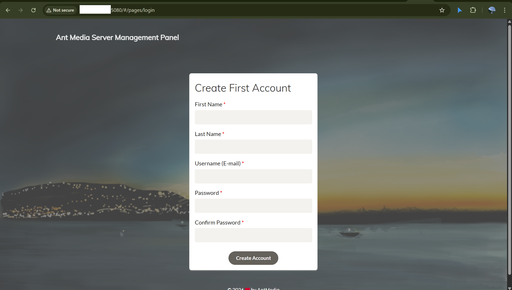

# Ant Media Server Script & YouTube Live Guide

Dự án cung cấp script cài đặt nhanh Ant Media Server (AMS) Community Edition trên Ubuntu và hướng dẫn cách live stream lên YouTube.



## 🚀 Cài đặt nhanh (Chọn hệ điều hành)

### 🐧 Ubuntu / Debian
```bash
curl -sSL https://raw.githubusercontent.com/Hud0520/ams-script/main/script/install_ams_ubuntu.sh | sudo bash
```

### 🐧 CentOS / RHEL
```bash
curl -sSL https://raw.githubusercontent.com/Hud0520/ams-script/main/script/install_ams_centos.sh | sudo bash
```

### 🍎 macOS (Intel/M1/M2)
```bash
curl -sSL https://raw.githubusercontent.com/Hud0520/ams-script/main/script/install_ams_macos.sh | bash
```

### 🪟 Windows (WSL2)
*Mở PowerShell với quyền Admin và chạy:*
```powershell
Set-ExecutionPolicy Bypass -Scope Process -Force; [System.Net.ServicePointManager]::SecurityProtocol = [System.Net.ServicePointManager]::SecurityProtocol -bor 3072; iex ((New-Object System.Net.WebClient).DownloadString('https://raw.githubusercontent.com/Hud0520/ams-script/main/script/install_ams_windows.ps1'))
```

---

## 📺 Hướng dẫn Live Stream lên YouTube

Sau khi cài đặt xong, hãy làm theo các bước sau để phát trực tiếp lên YouTube:

### 1. Truy cập Dashboard
- Mở trình duyệt và truy cập: `http://<IP_CUA_BAN>:5080`
- Lần đầu truy cập, bạn cần tạo tài khoản quản trị (Username/Password).

### 2. Tạo Live Stream mới
- Chọn ứng dụng mặc định (ví dụ: `WebRTCApp` hoặc `LiveApp`).
- Nhấn vào nút **"New Live Stream"**.
- Chọn **"Live Stream"** và đặt tên cho luồng.

### 3. Cấu hình đẩy luồng lên YouTube (RTMP Endpoint)
- Trong danh sách các luồng, nhấn vào nút **"Edit"** hoặc biểu tượng bánh răng bên cạnh luồng vừa tạo.
- Tìm mục **"RTMP Endpoints"**.
- Nhấn **"Add RTMP Endpoint"**.
- Nhập URL và Stream Key từ YouTube:
    - **RTMP URL:** `rtmp://a.rtmp.youtube.com/live2`
    - **Stream Key:** (Lấy từ [YouTube Studio](https://studio.youtube.com/))
- Nhấn **"Add"**.

### 4. Bắt đầu Live Stream
- Bạn có thể dùng WebRTC trực tiếp từ trình duyệt để bắt đầu phát, hoặc dùng OBS đẩy luồng vào Ant Media qua giao thức RTMP/SRT.
- Ant Media Server sẽ tự động đẩy (forward) luồng đó lên YouTube theo cấu hình đã thiết lập ở Bước 3.

---

## 📂 Hướng dẫn Upload Video (VoD)

Ngoài việc live stream, bạn có thể upload video để lưu trữ và phát lại:

### 1. Truy cập mục VoD
- Trong Dashboard, chọn ứng dụng của bạn (ví dụ: `WebRTCApp`).
- Nhấn vào tab **"VoD"** ở menu bên trái.

### 2. Upload File
- Nhấn nút **"Upload Video"**.
- Chọn file từ máy tính của bạn và nhấn **"Upload"**.
- Sau khi upload thành công, video sẽ xuất hiện trong danh sách.

### 3. Xem và Quản lý
- Bạn có thể nhấn vào biểu tượng **"Play"** để xem lại video trực tiếp trên trình duyệt.
- Ant Media hỗ trợ tự động tạo link HLS/MP4 để bạn nhúng vào website hoặc chia sẻ.

---

## 🛠️ Script này làm gì?
- Cập nhật hệ thống và cài đặt các package cần thiết (`wget`, `curl`, `ufw`, `logrotate`,...).
- Tải và cài đặt bản Community mới nhất của Ant Media Server trực tiếp từ GitHub.
- **Tường lửa (UFW):** Tự động mở các port cần thiết (1935, 5080, 5443, 50000-60000 UDP).
- **Log Management:** Cấu hình `logrotate` cực kỳ khắt khe (giới hạn 50MB, xoay vòng 2 file) để tránh đầy ổ cứng.